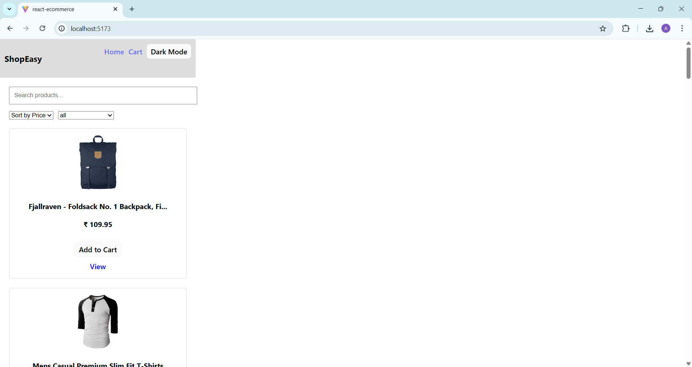
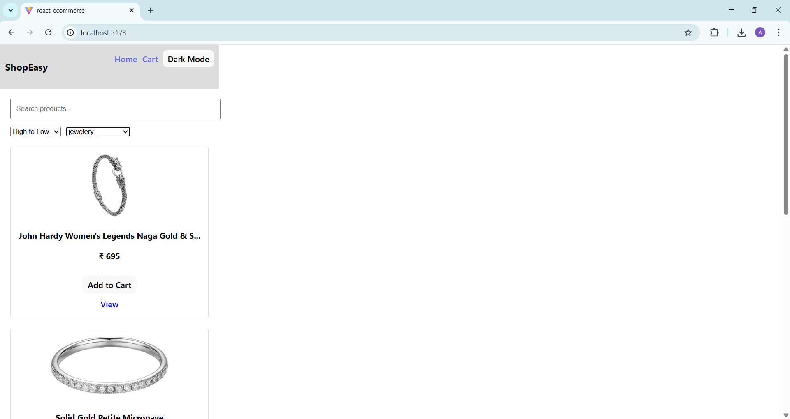
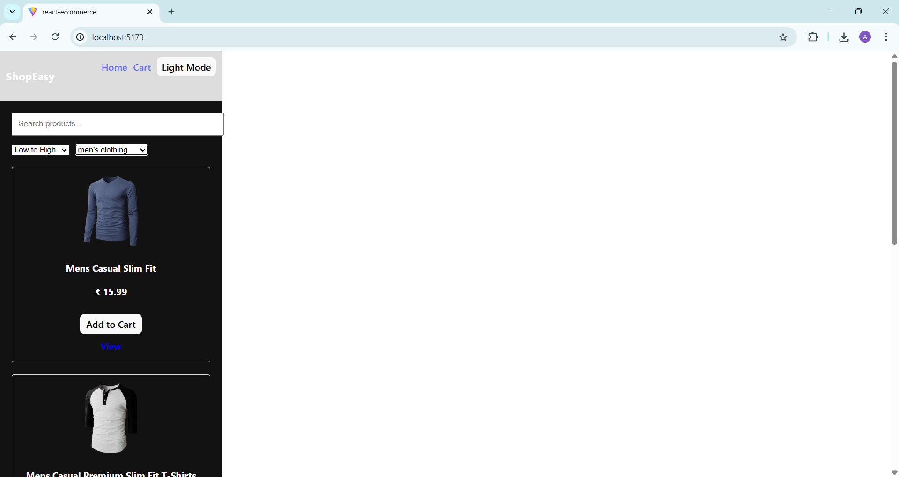
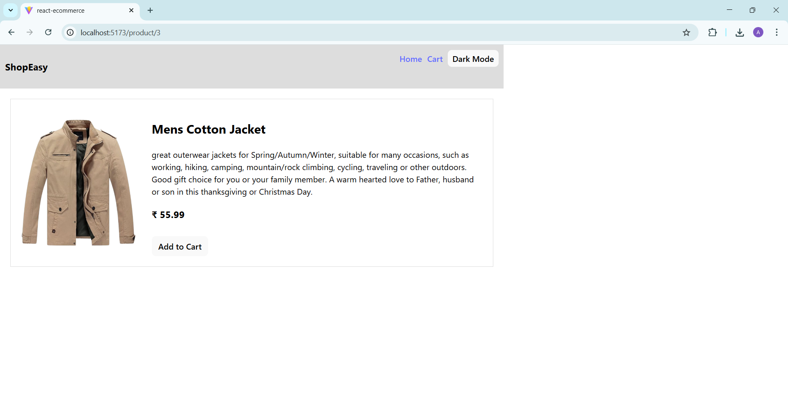
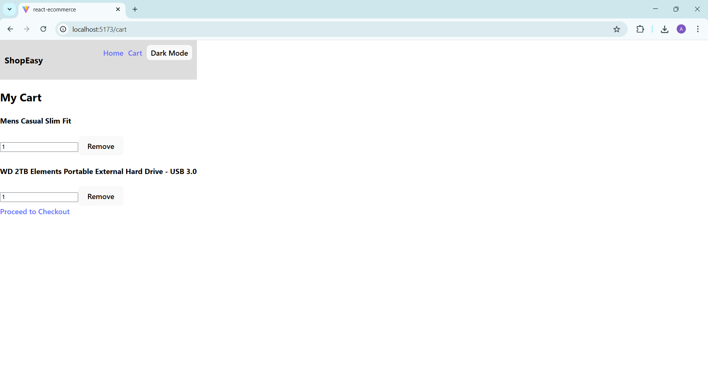
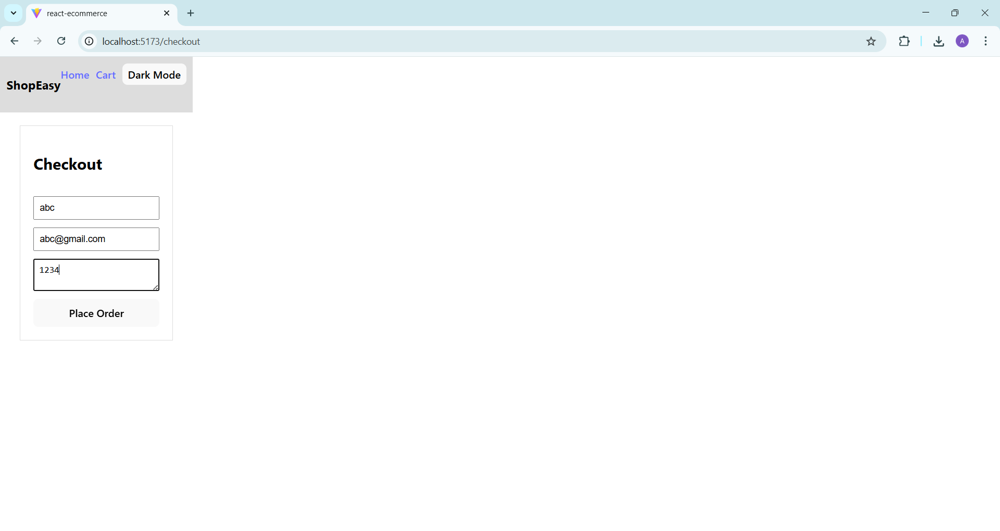
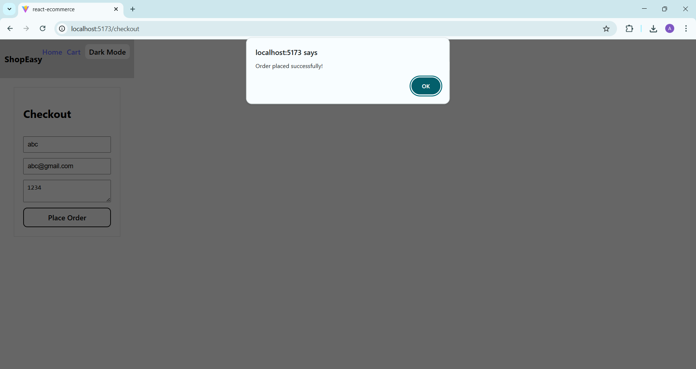

# React E-Commerce App

A simple React-based e-commerce application built as a capstone project.

## Features
- Product listing using FakeStore API
- Search, sort, and filter products
- Product details page
- Cart management using Zustand
- Checkout form with validation
- Light/Dark mode
- Responsive design

## Screenshots

## Tech Stack
- React
- React Router
- Zustand
- FakeStore API